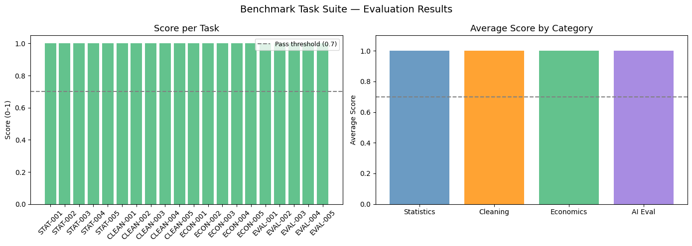

# Benchmark Task Suite
A collection of 20 structured benchmark tasks for evaluating AI systems
on real-world data analysis and economics problems.
Built as part of an AI evaluation engineering portfolio.

## What it does

Each task mirrors the structure used by professional evaluation
frameworks like OpenAI Evals, HELM, and MLE Bench:

| Component | Description |
|-----------|-------------|
| Input | Dataset and question given to the AI system |
| Expected output | What a correct answer looks like |
| Scoring function | Python code that checks correctness automatically |
| Difficulty | Easy / Medium / Hard |

## Task categories

### Category 1 — Descriptive Statistics (Tasks 1–5)
Tests whether an AI can correctly compute and interpret
basic statistical summaries from a dataset.

| Task | Question | Difficulty |
|------|----------|------------|
| STAT-001 | Mean revenue by region | Easy |
| STAT-002 | Top revenue quarter | Easy |
| STAT-003 | Records above revenue threshold | Easy |
| STAT-004 | Detect outliers using z-score | Medium |
| STAT-005 | Revenue-units correlation | Medium |

### Category 2 — Data Cleaning and Transformation (Tasks 6–10)
Tests ability to handle messy real-world data.

| Task | Question | Difficulty |
|------|----------|------------|
| CLEAN-001 | Normalise inconsistent category values | Easy |
| CLEAN-002 | Flag records with invalid year values | Easy |
| CLEAN-003 | Impute missing values with median | Medium |
| CLEAN-004 | Pivot table construction | Medium |
| CLEAN-005 | Filter and measure data loss percentage | Medium |

### Category 3 — Economics Analysis (Tasks 11–15)
Tests domain knowledge in macroeconomics and development economics.

| Task | Question | Difficulty |
|------|----------|------------|
| ECON-001 | Highest average GDP country | Easy |
| ECON-002 | Lowest average inflation year | Easy |
| ECON-003 | GDP per capita calculation | Medium |
| ECON-004 | Inflation-unemployment correlation | Medium |
| ECON-005 | Countries with persistently high unemployment | Hard |

### Category 4 — AI Output Evaluation (Tasks 16–20)
Tests ability to evaluate and score AI-generated analytical outputs.

| Task | Question | Difficulty |
|------|----------|------------|
| EVAL-001 | Score a correct numeric AI answer | Easy |
| EVAL-002 | Detect a wrong numeric AI answer | Easy |
| EVAL-003 | Evaluate reasoning quality on a rubric | Medium |
| EVAL-004 | Classify failure mode of a bad answer | Medium |
| EVAL-005 | Compute batch evaluation pass rate | Hard |

## Scoring system

Each task scores 0.0 to 1.0:

| Score | Meaning |
|-------|---------|
| 1.0 | Fully correct |
| 0.7 – 0.9 | Partially correct — right direction, minor error |
| 0.4 – 0.6 | Partial credit — some correct elements |
| 0.0 – 0.3 | Incorrect |

Pass threshold: **0.7**

## Results



| Category | Pass Rate | Avg Score |
|----------|-----------|-----------|
| Statistics | 100% | 1.00 |
| Data Cleaning | 100% | 1.00 |
| Economics | 100% | 1.00 |
| AI Evaluation | 100% | 1.00 |
| **Overall** | **100%** | **1.00** |

Note: results show reference implementation (correct answers fed
as model outputs). Use this suite to evaluate real AI system outputs
by replacing the model_answer variables with your system's responses.

## What makes a good benchmark task

1. **Unambiguous expected output** — one correct answer
2. **Automated scoring** — no human needed to judge
3. **Calibrated difficulty** — Easy / Medium / Hard in each category
4. **Domain grounding** — tasks reflect real analytical work
5. **Failure mode coverage** — tasks that catch different error types

## How to add your own tasks

```python
task_custom = {
    'task_id'    : 'CUSTOM-001',
    'difficulty' : 'Medium',
    'question'   : 'Your question here',
    'key_concepts': ['concept1', 'concept2']
}

def score_custom(model_output, expected_output):
    # Your scoring logic here
    if model_output == expected_output:
        return 1.0, 'Correct'
    return 0.0, f'Expected {expected_output}, got {model_output}'

result = score_task(
    task_custom['task_id'],
    your_model_answer,
    expected_output,
    score_custom
)
```
## Skills demonstrated

- Benchmark task design and difficulty calibration
- Automated scoring function engineering
- Economics and data analysis domain expertise
- Evaluation harness structure
- Partial credit rubric design

## Author
Abigael Cherotich — Data Analyst & AI Evaluation Specialist

[LinkedIn](your-linkedin-url-here)
